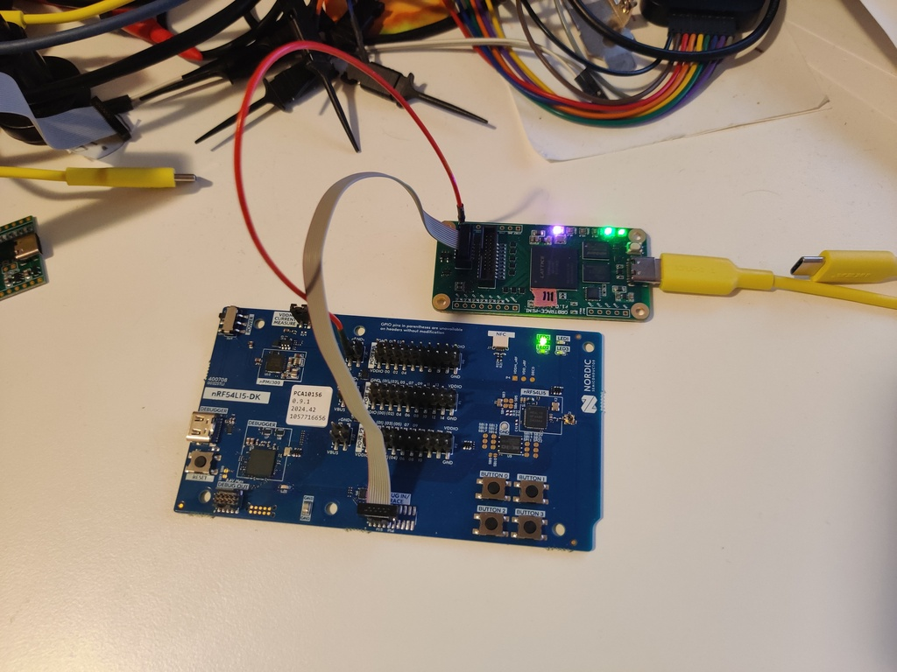
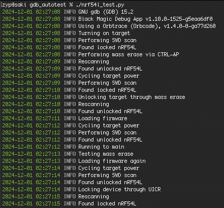

# GDB Autotest

This is a simple utility initially written to aid testing during development of nRF54L support in [Black Magic Debug](https://github.com/blackmagic-debug/blackmagic).

The script starts GDB and Black Magic Debug, runs through a sequence that tests everything that requires special handling for nRF54L and then cleans up after itself.

Test setup consists of a nRF54L15-DK connected to and powered from an Orbtrace Mini:

Resulting output:

